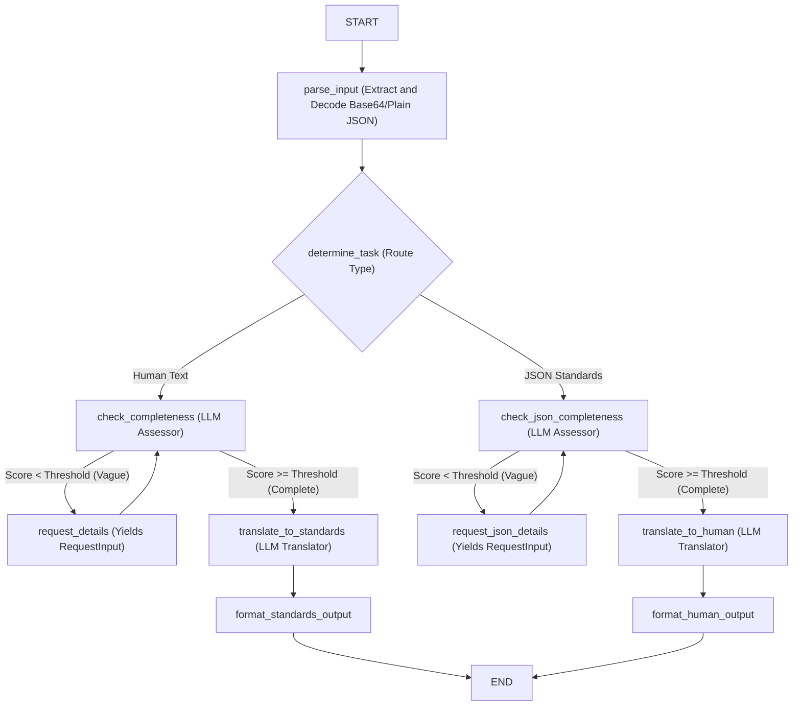

# thai-medical-records


Agent generated with `agents-cli` version `0.6.1`

## Project Structure

```
thai-medical-records/
├── app/         # Core agent code
│   ├── agent.py               # Main agent logic
│   ├── fast_api_app.py        # FastAPI Backend server
│   └── app_utils/             # App utilities and helpers
├── tests/                     # Unit, integration, and load tests
├── GEMINI.md                  # AI-assisted development guide
└── pyproject.toml             # Project dependencies
```

> 💡 **Tip:** Use [Antigravity CLI](https://antigravity.google/) for AI-assisted development - project context is pre-configured in `GEMINI.md`.

## Requirements

Before you begin, ensure you have:
- **uv**: Python package manager (used for all dependency management in this project) - [Install](https://docs.astral.sh/uv/getting-started/installation/) ([add packages](https://docs.astral.sh/uv/concepts/dependencies/) with `uv add <package>`)
- **agents-cli**: Agents CLI - Install with `uv tool install google-agents-cli`
- **Google Cloud SDK**: For GCP services - [Install](https://cloud.google.com/sdk/docs/install)


## Quick Start

Install `agents-cli` and its skills if not already installed:

```bash
uvx google-agents-cli setup
```

Install required packages:

```bash
agents-cli install
```

Test the agent with a local web server:

```bash
agents-cli playground
```

You can also use features from the [ADK](https://adk.dev/) CLI with `uv run adk`.

## Commands

| Command              | Description                                                                                 |
| -------------------- | ------------------------------------------------------------------------------------------- |
| `agents-cli install` | Install dependencies using uv                                                         |
| `agents-cli playground` | Launch local development environment                                                  |
| `agents-cli lint`    | Run code quality checks                                                               |
| `agents-cli eval`    | Evaluate agent behavior (generate, grade, analyze, and more — see `agents-cli eval --help`) |
| `uv run pytest tests/unit tests/integration` | Run unit and integration tests                                                        || [A2A Inspector](https://github.com/a2aproject/a2a-inspector) | Launch A2A Protocol Inspector                                                        |

## 🛠️ Project Management

| Command | What It Does |
|---------|--------------|
| `agents-cli scaffold enhance` | Add CI/CD pipelines and Terraform infrastructure |
| `agents-cli infra cicd` | One-command setup of entire CI/CD pipeline + infrastructure |
| `agents-cli scaffold upgrade` | Auto-upgrade to latest version while preserving customizations |

---

## Development

Edit your agent logic in `app/agent.py` and test with `agents-cli playground` - it auto-reloads on save.

## Deployment

```bash
gcloud config set project <your-project-id>
agents-cli deploy
```

To add CI/CD and Terraform, run `agents-cli scaffold enhance`.
To set up your production infrastructure, run `agents-cli infra cicd`.

## Observability

Built-in telemetry exports to Cloud Trace, BigQuery, and Cloud Logging.

## A2A Inspector

This agent supports the [A2A Protocol](https://a2a-protocol.org/). Use the [A2A Inspector](https://github.com/a2aproject/a2a-inspector) to test interoperability.
See the [A2A Inspector docs](https://github.com/a2aproject/a2a-inspector) for details.

## Implemented Architecture & Project Concept

### Concept
The **Thai Medical Record Agent** is an intelligent assistant designed to solve the critical gap in digital healthcare digitization for clinical workflows in Thailand. Clinical records are often written in free-form natural language (sometimes a hybrid of Thai and English) and need to be translated into structured, standards-compliant medical payloads (such as HL7 FHIR, Thai Medicines Terminology (TMT), and SNOMED CT) for database storage and interoperability. Conversely, structured records must be readable by humans in clean clinical summaries.

To ensure safety and data quality, the agent integrates a **Human-in-the-Loop (HITL)** loop: if a clinician provides vague or incomplete information, the agent halts execution, asks for the specific missing fields, and resumes once provided.

### Architecture (ADK 2.0 Graph Workflow)

The agent uses the **ADK 2.0 Workflow API** to build a robust, state-guided execution graph. This architecture avoids sequential bottlenecks and guarantees deterministic, validated transitions.



### Components
1. **Parser & Classifier**: Decodes inputs (supporting base64/JSON strings) and auto-detects if the input is a clinical text narrative or a structured standards JSON payload.
2. **Completeness Assessors**: Uses `gemini-3.1-flash-lite` to score record completeness against clinical schemas. Scores under the threshold trigger a suspension.
3. **Suspension & Resume Nodes**: Employs `RequestInput` to pause execution, allowing interactive doctor-feedback loops.
4. **Standards Translators**:
   * *Text -> JSON*: Converts narratives into compliant HL7 FHIR Bundles and TMT drug/procedure mappings.
   * *JSON -> Text*: Translates machine-readable records into readable medical summaries.

---

## License & Data Usage

### Competition Guidelines
This project is submitted to the [Kaggle x Google AI Agents Intensive Capstone Project 2026](https://www.kaggle.com/competitions/vibecoding-agents-capstone-project).
In accordance with the [Competition-Specific Rules (Section 2)](https://www.kaggle.com/competitions/vibecoding-agents-capstone-project/rules#2.-competition-specific-rules):
* **License**: All source code and assets in this repository are licensed under the **Creative Commons Attribution 4.0 International (CC-BY 4.0)** license. You are free to share, adapt, and use the code for any purpose, including commercial use, provided appropriate credit is given.
* **Data Usage Policy**: This project uses exclusively **synthetic mock clinical data** for testing and demonstration purposes. No real, identifiable patient data or protected health information (PHI) has been used, stored, or processed, aligning fully with data privacy and competition integrity guidelines.

---

## Built For
Kaggle x Google AI Agents Intensive Vibe Coding Capstone 2026 Track: Agents for Good

Thai Medical Record — The first step for medical record data records.


